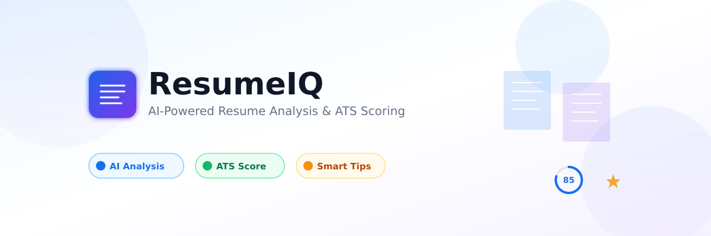
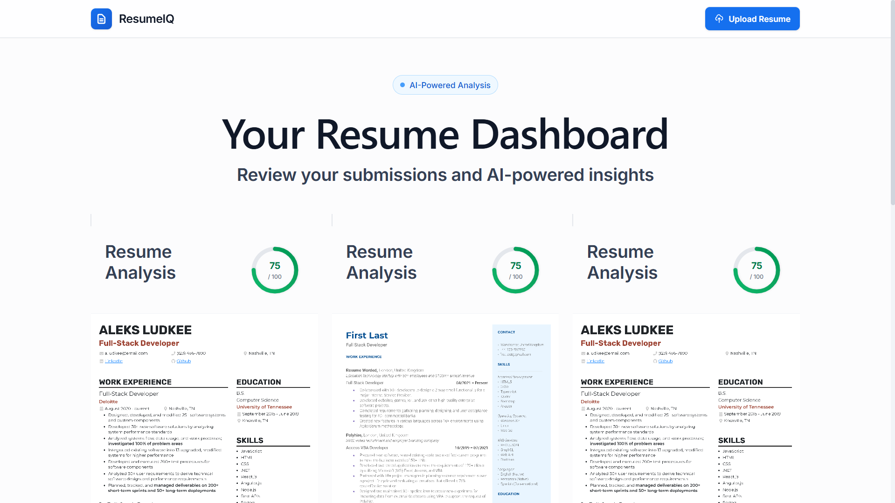
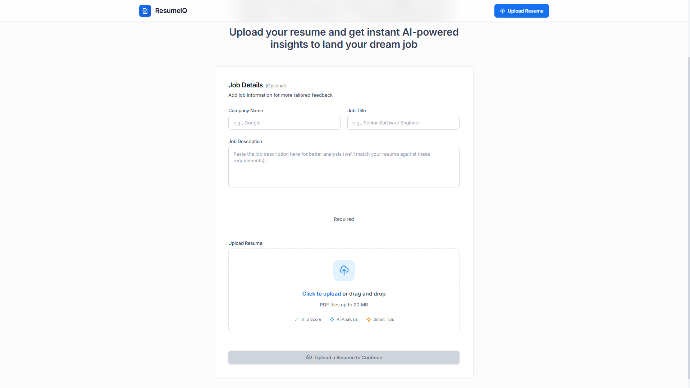
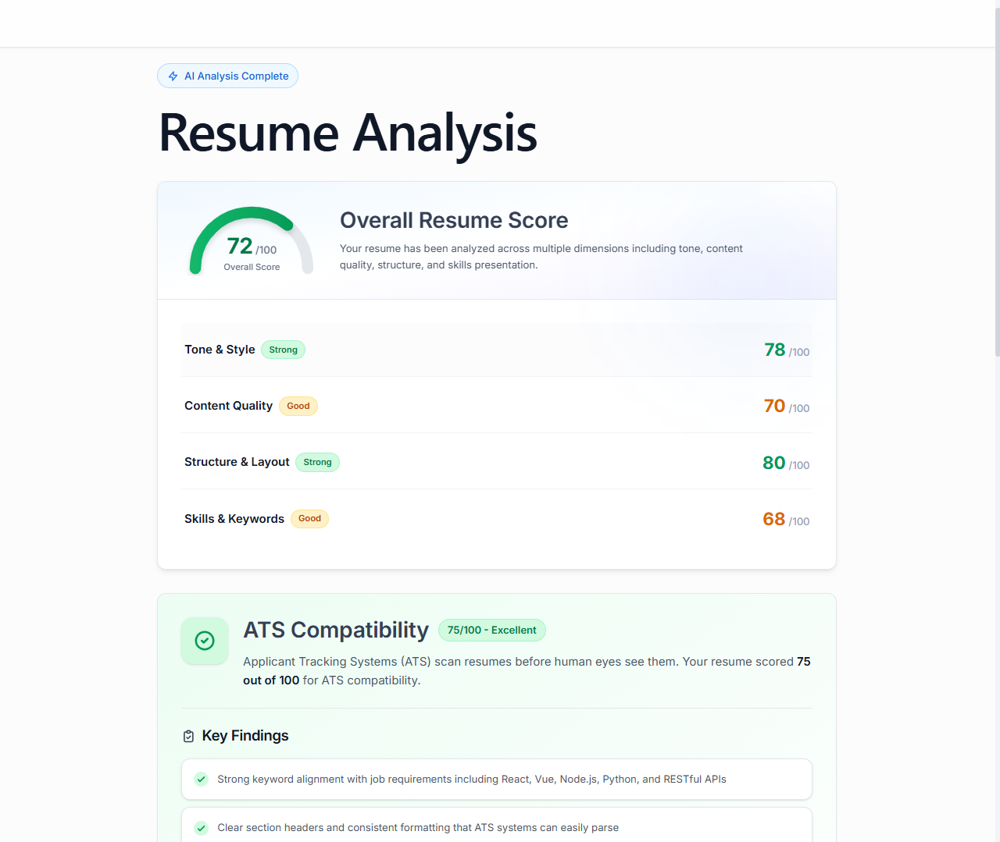
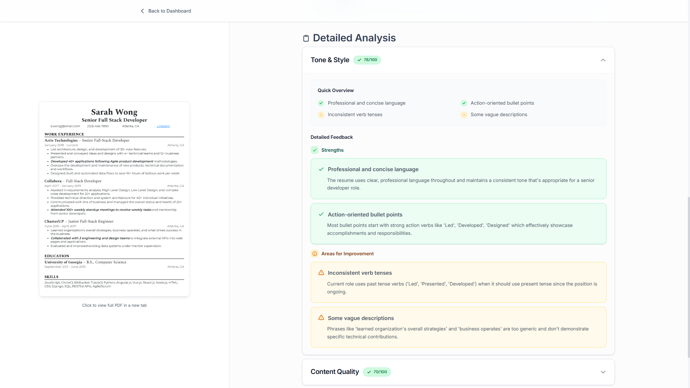

# 🎯 ResumeIQ – AI-Powered Resume Analyzer

> Smart, instant feedback for your dream job. Get AI-powered resume analysis, ATS scoring, and personalized improvement tips in seconds.

**🔗 Live Demo:** [https://resumeiq-eight.vercel.app/](https://resumeiq-eight.vercel.app/)

[](https://reactjs.org/) 
[](https://www.typescriptlang.org/) 
[](https://tailwindcss.com/) 
[](https://puterjs.com/)
[](LICENSE)

  
*Modern, AI-powered resume analysis platform*

---

## 📋 Table of Contents

- [Overview](#-overview)  
- [Features](#-features)  
- [Tech Stack](#-tech-stack)  
- [Screenshots](#-screenshots)  
- [Getting Started](#-getting-started)  
- [Project Structure](#-project-structure)  
- [Usage](#-usage)  
- [Contributing](#-contributing)  
- [License](#-license)  

---

## 🌟 Overview

**ResumeIQ** helps job seekers optimize their resumes with AI-powered analysis. Upload your resume (PDF), optionally include job details, and receive instant, comprehensive feedback:

- **ATS Score** – Compatibility with Applicant Tracking Systems  
- **AI Analysis** – Feedback on tone, content, structure, and skills  
- **Actionable Tips** – Personalized suggestions for improvement  
- **Visual Dashboard** – Track all your resume submissions

Built with **React**, **Tailwind CSS**, and powered by **Claude AI** via **Puter.js** for secure, private processing.

---

## ✨ Features

### 🤖 AI-Powered Analysis
- Smart resume parsing with Claude AI  
- ATS scoring for better recruiter visibility  
- Multi-dimensional feedback: tone, content, structure, skills  
- Job-specific insights tailored to your target role  

### 📊 User Dashboard
- Resume gallery with cards and previews  
- Circular progress and gauge visualizations  
- Expandable sections for detailed analysis  
- Side-by-side PDF preview  

### 🎨 Modern UI/UX
- Professional SaaS-style design (Cal Sans + Inter)  
- Fully responsive on desktop, tablet, and mobile  
- Smooth animations and micro-interactions  
- WCAG AA accessibility compliance  

### 🔐 Privacy & Security
- Client-side processing via Puter.js  
- No server storage of resumes  
- Secure authentication managed by Puter  

---

## 🛠 Tech Stack

**Frontend**  
- React 18, React Router 7  
- TypeScript, Tailwind CSS 4  
- Vite for development and build

**State Management**
- **[Zustand](https://zustand-demo.pmnd.rs/)** - Lightweight state management for Puter integration

**Backend / Services**  
- Puter.js – cloud storage, authentication, AI integration  
- Claude AI – resume analysis via Anthropic API  
- PDF.js – PDF → image conversion  

**UI Components & Libraries**  
- React Dropzone for file uploads  
- Custom components: Accordion, Score Gauges, Resume Cards, etc.  

---

## 📸 Screenshots

**Dashboard**  
  
*Resume gallery with score visualization*

**Upload & Analysis**  
  
*File upload with optional job details form*

**Detailed Report**  
  
*Comprehensive AI feedback and ATS scoring*

**Resume Preview**  
  
*Side-by-side resume viewing*

---

## 🚀 Getting Started

### Prerequisites
- Node.js 18.x+  
- npm, yarn, or pnpm  
- Git  
- Puter account ([Sign up](https://puter.com/))

### Installation
1. **Clone the repository**
   ```bash
   git clone https://github.com/squidward69/ai-resume-analyzer
   cd ai-resume-analyzer
   ```

2. **Install dependencies**
   ```bash
   npm install
   ```
   
3. **Run the development server**
   ```bash
   npm run dev
   ```

4. **Open your browser**
   
   Navigate to `http://localhost:5173`
   
---

## 📁 Project Structure

```
ai-resume-analyzer/
├── app/
│   ├── components/       # Reusable UI components
│   ├── routes/           # Route components (auth, home, resume, upload, wipe)
│   ├── lib/              # Utilities
        ├──pdf2img.ts     # PDF → image conversion
        ├──puter.ts       # Puter.js integration & Zustand store 
        ├──utils.ts       # Helper functions
  
│   └── root.tsx
├── types/                # TypeScript type definitions
├── public/               # Static assets
    ├── readme/           # Screenshots for README
├── .gitignore
├── package.json
├── tsconfig.json
├── vite.config.ts
├── README.md
└── LICENSE
```

---

## 💻 Usage

1. **Sign in** via Puter authentication
2. **Upload PDF resume** (optional: job details)
3. Click **Analyze Resume with AI**
4. View **ATS score**, detailed AI feedback, and resume preview
5. Track progress via the **dashboard**

---

## 🤝 Contributing

Contributions are welcome! Please follow these steps:

1. Fork the repository
2. Create a feature branch (`git checkout -b feature/amazing-feature`)
3. Commit your changes (`git commit -m 'feat: add amazing feature'`)
4. Push to the branch (`git push origin feature/amazing-feature`)
5. Open a Pull Request

---

## 📄 License

This project is licensed under the **MIT License** – see [LICENSE](LICENSE) for details.

---

## 📊 Project Stats


---

## 🗺️ Roadmap

- [ ] Add support for multiple resume formats (Word, TXT)
- [ ] Implement resume comparison feature
- [ ] Add resume template suggestions
- [ ] Create browser extension for quick analysis
- [ ] Add export to PDF with improvements highlighted
- [ ] Implement job matching based on resume analysis
- [ ] Multi-language support

---

## 🐛 Known Issues

- PDF processing may take longer for large files (>5MB)
- Some PDFs with complex layouts may not parse perfectly
- Mobile file upload requires proper permissions

See [Issues](https://github.com/squidward69/ai-resume-analyzer/issues) for a complete list.

---

<div align="center">

**Built with ❤️ and AI**

If you found this helpful, give it a ⭐️!

[Report Bug](https://github.com/squidward69/ai-resume-analyzer/issues) · [Request Feature](https://github.com/squidward69/ai-resume-analyzer/issues) · [View Demo](https://resumeiq-eight.vercel.app/)

</div>


